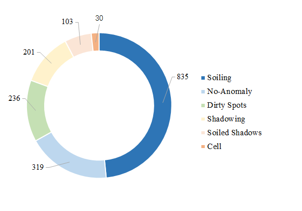

## Dataset Source
The dataset was publicly released by the Sensing and Control Laboratory at Hangzhou Dianzi University.

## Data Collection

"The urban building rooftop photovoltaic dataset" is a deep learning dataset designed for studying photovoltaic systems installed on rooftops of urban buildings. We employed a Matrice 350 RTK UAV equipped with a Zenmuse H20 infrared imaging camera to capture a total of 1,724 thermographic images on the roofs of three building complexes. The samples encompassed six different classes. The UAV was positioned at a height of 8.5-10 meters above the PV panels at a vertical angle, resulting in clear images with a resolution of 128x200 pixels. The images were captured between 2-5 pm on a sunny day to ensure consistent lighting conditions.

## Capture Conditions

- **Equipment**: Matrice 350 RTK UAV with Zenmuse H20 infrared imaging camera
- **Number of Images**: 1,724
- **Location**: Roofs of three building complexes
- **Sample Classes**: Six different classes
- **Positioning**: Height of 8.5-10 meters above the PV panels
- **Time of Capture**: Between 2-5 pm on a sunny day
- **Image Resolution**: 128x200 pixels

## Definitions of different faults in the urban building rooftop photovoltaic dataset, along with possible manifestations and potential causes.

## Number of Images for Each Class in the Urban Building Rooftop Photovoltaic Dataset
Here is the distribution of the number of images for each class in the dataset:
- Soiling: 835 images
- No-Anomaly: 319 images
- Dirty Spots: 236 images
- Shadowing: 201 images
- Soiled Shadows: 103 images
- Cell: 30 images

